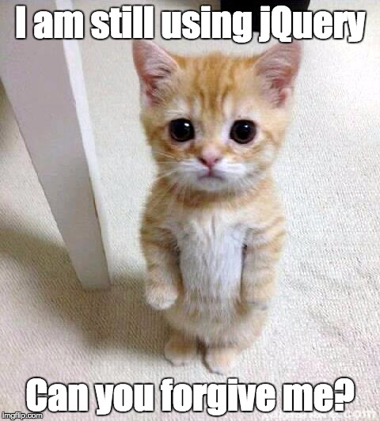

# Javascript - Web JQuery - challenge!!
Javascript is used for many things. At Holberton School, you will use Javascript for 2 reasons:
- Scripting (same as we did with Python)
- Web front-end

## Topics
* Why jQuery make front-end programming so easy (dont forget to tweet today, with the hashtag #ilovejquery :))
* How to select HTML elements in Javascript
* How to select HTML elements with jQuery
* What are differences between ID, class and tag name selectors
* How to modify an HTML element style
* How to get and update an HTML element content
* How to modify the DOM
* How to make a GET request with jQuery Ajax
* How to make a POST request with jQuery Ajax
* How to listen/bind to DOM events
* How to listen/bind to user events

## Requirements
* Google Chrome (version 57.0 or later)
* jQuery version 3.x

## More info

#### Import jQuery
```bash wrap
<head>
    <script src="https://code.jquery.com/jquery-3.2.1.min.js"></script>
</head>
```



#### semi-standard
[Semistandard](https://intranet.hbtn.io/rltoken/FuXjfOYe18hUXCDoyMxBSg)

## Installation

### Alternative 1 to deploy: using the git utility
Clone the repo in your directory structure:
```bash wrap
vagrant@ubuntu:~$ git clone https://github.com/gogomillan/holbertonschool-higher_level_programming.git
vagrant@ubuntu:~$ cd holbertonschool-higher_level_programming
vagrant@ubuntu:~$ cd 0x15-javascript-web_jquery
```
Now you can see the `index.html` file and the other `.html` files

### Alternative 2 to deploy: using a ZIP file
* Download it from this url: `https://github.com/gogomillan/holbertonschool-higher_level_programming/archive/master.zip`
* Uncompress the file
* Go into the `holbertonschool-higher_level_programming/0x15-javascript-web_jquery` directory
* Now you can see the `index.html` file and the other `.html` files

### After deploy always using the browser:
According to the previous steps either using git or using ZIP, it is necessary
to use then a browser to see the `index.html` file or each `.html` file you are
interested in [Go to ...](index.html):

## Challenges

#### 0. No jQuery : 
Files ([0-main.html](0-main.html), [0-script.js](0-script.js))

#### 1. With jQuery
Files ([1-main.html](1-main.html), [1-script.js](1-script.js))

#### 2. Click and turn red
Files ([2-main.html](2-main.html), [2-script.js](2-script.js))

#### 3. Add `.red` class
Files ([3-main.html](3-main.html), [3-script.js](3-script.js))

#### 4. Toggle classes
Files ([4-main.html](4-main.html), [4-script.js](4-script.js))

#### 5. List of elements
Files ([5-main.html](5-main.html), [5-script.js](5-script.js))

#### 6. Change the text
Files ([6-main.html](6-main.html), [6-script.js](6-script.js))

#### 7. Star wars character
Files ([7-main.html](7-main.html), [7-script.js](7-script.js))

#### 8. Star Wars movies
Files ([8-main.html](8-main.html), [8-script.js](8-script.js))

#### 9. Say Hello!
Files ([9-main.html](9-main.html), [9-script.js](9-script.js))

#### 10. No jQuery - document loaded
Files ([100-main.html](100-main.html), [100-script.js](100-script.js))

#### 11. List, add, remove
Files ([101-main.html](101-main.html), [101-script.js](101-script.js))

#### 12. Say hello to everybody! 
Files ([102-main.html](102-main.html), [102-script.js](102-script.js))

#### 13. And press ENTER
Files ([103-main.html](103-main.html), [103-script.js](103-script.js))

## Author
Gonzalo Gomez Millan | :octocat: [GitHub](https://github.com/gogomillan)
